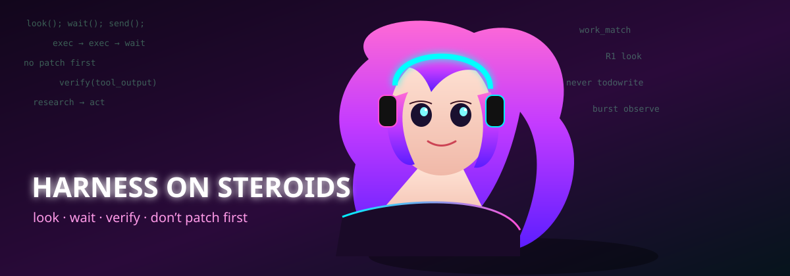

  

# Why coding agents flake — and what this repo is doing about it

A strong model is not enough. **ChatGPT Work** (Codex on a real desktop) often feels more reliable than **Kilo** or **OpenCode** even when those products use strong models too. This project treats that gap as a **harness** problem: how the wrapper makes the model look, wait, split work, check itself, and stop — not as “pick a better LLM.”

The gold is **your local ChatGPT Work transcripts**. We study how Work actually ran jobs, write that down, and teach Kilo and OpenCode to follow the same habits. We are not standing up a public coding contest (SWE-bench, Harbor, and friends are out of scope).

  

## The problem, in human terms

A coding agent is a model plus tools plus a loop: research, plan, edit, verify, maybe spawn help, repeat. If that loop is sloppy — write first, invent a todo list, bash around, never wait, never look again — the same “smart” model ships brittle work.

Work’s logs, on this machine, show a different loop:

- **Look before you change anything.** Run small inspect steps in a burst.
- **Wait** when something is slow instead of guessing.
- **Split** multi-piece jobs by sending a named slice *after* looking — not by spawning on the first tool.
- **Almost never patch** in Work (one session in 83). VS Code Codex *does* patch a lot; we do not copy that sandwich as “Codex.”
- **Never start with a plan file.** Work’s `update_plan` count is zero.
- **Verify:** after a write or a failure, look again. Prose is not proof.

That is research, planning, coding, verification, and agent loops as **behavior**, not as a slogan.

## What we are trying to copy

Make **Kilo** (whatever model it is using now) and **OpenCode** (including free models in build mode) **imitate Work**, as a selectable Codex mode. Same models you already run. Different wrapper instructions and checks.

  

A later owner ask: don’t stop at “who called which tool.” Replay **the same Work jobs** (long threads, not eight one-liners), including **morphed** wording so we don’t overfit, and score **whether the job was actually worked** — research, checks, files — against how Work ran it. Prompts stay on disk, not in git.

## What we’ve done so far

- Hashed **~1500** local Codex rollouts (no chat text in git).
- Separated **Work** from VS Code, Desktop, and empty `codex_exec` stubs so we don’t average the wrong product.
- Wrote a **Codex mode** for both Kilo and OpenCode: look first, wait, send after looking, don’t Todowrite, don’t bash first.
- Built a **process scorer** (look-first, no extra writes, no todo-first, look-after-edit). Work itself passes almost all of those checks. Live Kilo/OpenCode `code`/`build` sessions still often write or todo too soon.
- Started **matched-task** plumbing: 22 long Work threads listed (16 to learn on, 6 longest held out). Kilo has been run on those hashes **in this repo**; OpenCode only on a few. Full “same job, same reliability as Work” is **not finished**.

## How results stay reproducible

- **CI** (`.github/workflows/owner-gate.yml`) runs property, mutation, metamorphic, differential, and holdout tests. You cannot “fix” the project by deleting the owner rules.
- **Snapshots** under `reports/versions/` keep older interpretations instead of silently overwriting them.
- **Corpus** is copy-hashed locally; git holds counts and specs, not message bodies.
- **Modes** are paired: a change in Kilo Codex mode should have the OpenCode twin.

## What each piece is for

| Piece | Role |
| --- | --- |
| `AGENTS.md` / `PLAN.md` | Owner rules. Transcripts are gold. Agents don’t replace the plan. |
| `reports/` | What we measured (Work vs vscode vs exec, wait/send/patch rates). |
| `spec/codex-imitate-mode.md` | The loop a coding agent should follow. |
| `.kilo/agent/codex.md` and `.opencode/agent/codex.md` | The mode you pick in each product. |
| `src/score_session.py` | Cheap process checks on tool order. |
| `spec/matched-task-eval.md` | Same Work jobs, outcome + morphs, holdout so we don’t overfit. |
| `tests/` | Guardrails so we don’t drift into SWE-bench or drop the gold clause. |

## Where it stands

The **recipe** is written. The **products have a mode**. **Process** scoring shows Work and the copies still diverge on live sessions. **Outcome** replay on long Work threads is in progress (Kilo notes on 22 hashes in this worktree; OpenCode lagging; morphs not done). You decide when behavior matches.

## The content and visual contract

This README follows the pinned [`content-generation-modules` v0.1.2](https://github.com/Pukujan/content-generation-modules/releases/tag/v0.1.2) adapter in [`.content-system/`](.content-system/). **Narrative raster images carry a short title and subtitle** so the picture can orient a reader on its own; SVGs and tiny helper graphics stay text-free. The full story and responsive review page live in [`docs/content-system-preview.md`](docs/content-system-preview.md) and [`docs/content-system-preview.html`](docs/content-system-preview.html).

## Outside work that rhymes (not our exam)

We are not validating on public leaderboards. The *idea* that **the loop around the model** matters is not unique to this repo:

- **ReAct** (Yao et al.): interleave reasoning with tools instead of one-shot answers.
- **SWE-agent / OpenHands-style papers:** scaffolding, tools, and retry policy often move coding-agent scores as much as swapping the base model — we refuse to *become* those benchmarks.
- **Industry write-ups** on “agent harnesses” (workflows, permissions, verification, memory): same claim you made — reliability is often the wrapper.

Those sources **support the bet**. They do **not** replace your Work transcripts as gold.

## Read next (if you need to edit)

`AGENTS.md` → `PLAN.md` → `HANDOFF.md`. Don’t commit `data/` or chat bodies.
