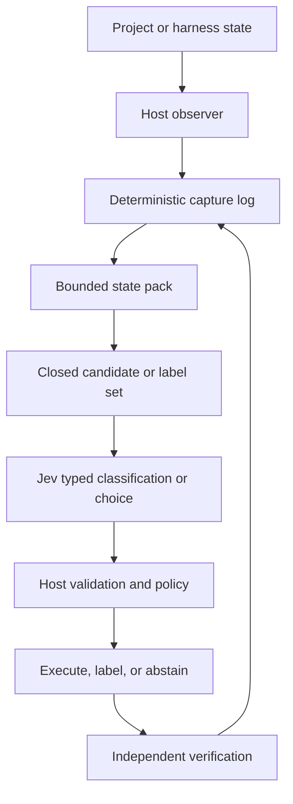

# Jev classification versus data capture

Date: 2026-09-22  
Status: research finding; no runtime change made by this note

## Executive answer

Jev is useful for **bounded classification, scoring, and routing** when the
host supplies the state and a closed set of legal answers. Jev is not a data
capture layer, repository observer, project-memory store, executor, or
verifier.

The durable boundary is:

Jev may enrich captured data, but it must not replace the capture log. If the
Jev request fails, the trajectory and source evidence must still exist.

## What the external evidence shows

TypeSafe describes System One models as evaluating application-supplied state
and returning typed answers, probabilities, and confidence. The primitives
are `Choice`, `Score`, and `Noul`; the application combines those answers with
deterministic checks. Jev accepts text, JSON objects, and arrays of text, not
direct filesystem, browser, shell, or media authority.

- Official System One documentation:
  https://docs.typesafe.ai/concepts/system-one
- High-star `browser-use/jev-ultrafast` agent source:
  https://github.com/browser-use/jev-ultrafast/blob/main/jev_ultrafast/agent.py
- TypeSafe playground browser-agent contract:
  https://github.com/TypeSafeAI/typesafe-playground/blob/main/docs/jev-browser-agent.md
- TypeSafe playground tool-router contract:
  https://github.com/TypeSafeAI/typesafe-playground/blob/main/docs/tool-router.md
- Independent router implementation:
  https://github.com/TypeSafeAI/typesafe-router

The public integrations consistently use this sequence:

1. Host code observes the live environment.
2. Host code assigns stable identities and bounds the observation.
3. Host code constructs the legal operation, target, workflow-node, or label
   candidates.
4. Jev returns a typed selection or score.
5. Host code checks membership, confidence, freshness, policy, and budgets.
6. Host code executes or records an abstention.
7. Host code observes and independently verifies the result.
8. The next decision receives the refreshed observation.

In Jev Ultrafast, the browser host reads the page, builds an indexed element
table, supplies the goal, visible page state, and recent actions, then maps
Jev's choice back to a host-owned target. It rejects stale, hidden, disabled,
covered, or disconnected targets and independently verifies completion. The
model does not return selectors, coordinates, JavaScript, or arbitrary action
arguments.

The TypeSafe playground tool router is even closer to a coding harness: hard
rules run before Jev, Jev receives the current graph node and permitted
outgoing nodes, and the host checks graph membership and policy again. The
selected node is not authorization and is not execution.

These are architecture observations from public code and documentation. They
are not a general benchmark of Jev's accuracy.

## What our experiment actually tested

Our Issue 22 matched A/B supplied Jev with a host-built `DecisionContext` and
a closed action set. The context included:

- the owner ask and current turn;
- phase and currently legal actions;
- candidate beads and acceptance criteria;
- bounded repository facts and changed paths;
- small redacted file excerpts where the feeder found relevant paths;
- recent normalized adapter events and statuses;
- test results, verification evidence, constraints, retry state, and input
  status.

The feeder was real host code. Jev did not open the repository or capture any
of those facts. The feeder was also incomplete: it did not automatically read
`CURRENT.md`, `HANDOFF.md`, `ISSUES.md`, the active issue body, a full diff, or
the complete relevant files. Its four initial beads were generic
`inspect-context`, `plan-change`, `execute-change`, and `verify-result`
placeholders rather than a project-specific decomposition.

The clean matched run used 60 turns per arm across 16 development hashes for
OpenCode, Grok Build, and Pi:

| Harness | Work-match baseline | Work-match Jev | Jev decisions | Executed Jev turns | Low-confidence fallbacks |
| --- | ---: | ---: | ---: | ---: | ---: |
| OpenCode | 8/16 | 4/16 | 60 | 13 | 47 |
| Grok Build | 0/16 | 0/16 | 60 | 13 | 47 |
| Pi | 0/16 | 0/16 | 60 | 12 | 48 |

Mean Jev confidence was 0.419, 0.409, and 0.390 respectively, below the
0.55 execution gate. Therefore the current policy is not promoted. This is
evidence of severe under-execution under our gate, not proof that Jev cannot
classify a better-prepared coding state.

## Decision for the analytical machine

The transcript analysis machine should remain deterministic for capture and
structural normalization:

- adapters read the local evidence;
- canonical events preserve source identity and provenance pointers;
- lane analyzers compute reproducible structural metrics;
- missingness and unknowns remain explicit;
- the captured evidence is retained independently of any Jev call.

Jev may be tested as a **secondary annotation or shadow classifier** for a
small frozen sample. In that role, the host would provide one canonical event
or checkpoint, the relevant ontology definition, and a closed label set such
as `inspection`, `mutation`, `verification`, `research`, `unknown`, or
`abstain`. The host would record the exact request, typed answer, confidence,
model/configuration, and validation result. A human-adjudicated label remains
the reference; Jev output cannot silently become gold or rewrite deterministic
metrics.

Jev should not be used to capture the corpus because capture needs complete
ordering, source identity, duplicate policy, failure preservation, and
truthful recording even when the model is unavailable. Those are host and
deterministic-code responsibilities.

## Recommended test order

1. Complete the larger owner/human adjudication batch for the current
   structural ontology pilot. This supplies a reference before using Jev as
   an annotator.
2. Run the already-authorized Jev controller follow-up: keep the feeder,
   choices, models, fixtures, timeouts, and threshold fixed; execute the
   baseline-equivalent prompt on low-confidence decisions while recording Jev
   as advisory.
3. Separately run a small Jev shadow-label test on frozen, source-linked
   canonical events. Compare Jev against adjudicated labels by lane and label,
   including abstentions and invalid answers. Do not combine this with the
   controller A/B.

Until those tests exist, the correct claim is: **Jev is a promising bounded
decision component, and our integration has learned the host-feeder boundary,
but we have not yet demonstrated that Jev improves coding decisions or
transcript-label quality.**
