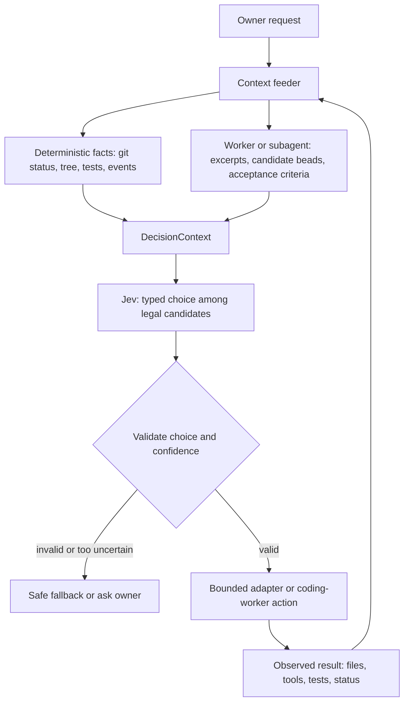

# Jev ecosystem evidence: state, agents, and live context

Updated: 2026-09-21

Status: research finding for Jev Controller v2; no runtime change is made by
this note.

## Executive finding

Jev is a decision-only component. It does not open files, inspect a browser,
call tools, run a subagent, or generate the next prompt. The integrating
program must supply the state and the closed set of permitted choices, then
validate Jev's typed answer and execute the selected option itself.

The strongest public agent example is
[browser-use/jev-ultrafast](https://github.com/browser-use/jev-ultrafast),
which showed 16.0k GitHub stars when checked on 2026-09-21. Its loop turns a
live browser observation into an indexed element table, sends the goal,
page/text state, recent actions, and compatible operation/target choices to
Jev, executes only the validated selection, observes the changed page, and
asks again. A small text model is used only when the selected operation needs
text entry. Jev is not the browser operator.

This directly answers the controller question: a coding integration needs a
context feeder. That feeder may be a deterministic repository observer, a
generative coding worker that inspects and proposes candidate beads, or both.
Jev can then choose among the live, legal candidates. A subagent is not
strictly required for facts that deterministic tools can collect, but Jev
cannot collect those facts by itself.

## Evidence from public implementations

| Project | Observable pattern | Relevance |
|---|---|---|
| [browser-use/jev-ultrafast](https://github.com/browser-use/jev-ultrafast) | Goal + page observation + indexed element table + recent actions -> Jev operation/target -> browser -> new observation. Only compatible operations and targets are offered. | High-star, real agent loop with live state and repeated decisions. |
| [TypeSafeAI/typesafe-playground browser agent](https://github.com/TypeSafeAI/typesafe-playground/blob/main/docs/jev-browser-agent.md) | `buildDecisionPayload` supplies the element table, page text, and last ten actions. Jev chooses an operation and a target head; freshness validation and execution remain in the host. | Confirms the context-feeder and validation boundary. |
| [TypeSafeAI/typesafe-playground tool router](https://github.com/TypeSafeAI/typesafe-playground/blob/main/docs/tool-router.md) | Hard rules run first; Jev receives the user request, current graph node, and complete permitted outgoing nodes. The host checks graph membership and policy again, with approval checkpoints. | Shows that Jev receives a live graph state and closed candidate set, not a global action catalog. |
| [TypeSafeAI/typesafe-router](https://github.com/TypeSafeAI/typesafe-router) | `request + allowed options -> Jev choice -> validation/fallback -> application executor`. The repository exposes `buildRouterContext` and `buildJevRequest` so the exact supplied context is inspectable. | Clean reference for policy, confidence thresholds, and executor separation. |
| [typesafe-jev-examples](https://github.com/rajivkuriakose/typesafe-jev-examples) | The routing policy is ordinary code: typed answers in, decision out. It keeps offline policy tests separate from live Jev calls. | Confirms that application code, not Jev, owns the action policy. |
| [Jev use-case playbook](https://github.com/Anil-matcha/awesome-jev-by-typesafe/blob/main/docs/jev-use-case-playbook.md) | Recommends named state objects containing the records needed for the judgment, then deterministic composition and fallback after Jev. Its agent-trace example keeps instructions, turns, tool arguments/results, final response, and feedback available for judging. | Provides the state and trace completeness pattern. |

The public [TypeSafe playground](https://github.com/TypeSafeAI/typesafe-playground)
also separates live, mocked, solver-verified, and failed outcomes. Its
tool-router documentation explicitly says its downstream tools are mocked;
that is useful architecture evidence, not a claim of production execution.

## What Jev actually receives

The public integrations use the same conceptual wire shape:

```json
{
  "state": {
    "description": "what this record contains",
    "records": [
      {
        "id": "current-task",
        "record": {
          "goal": "the owner request",
          "observations": "facts collected by the host",
          "history": "relevant prior actions and results",
          "candidates": "currently legal options"
        }
      }
    ]
  },
  "questions": {
    "next_step": {
      "type": "choice",
      "instructions": "Choose one permitted next step.",
      "criteria": {
        "inspect_file": "Use when repository facts are missing.",
        "run_test": "Use when a targeted check is ready.",
        "ask_owner": "Use when required information is missing."
      }
    }
  }
}
```

The `record` is supplied by the host. Jev has no file-system or tool
authority. The `criteria` values form a closed set; the host must reject an
answer outside that set or below its confidence policy. The public router
example uses an explicit safe default or clarification result, and the
browser/tool examples validate the selected node/target before execution.

## Comparison with our v2 slice

Our current live runner in `research/run_jev_controller_v2.py` supplied:

- the real owner ask extracted from the Work task;
- phase `intake`;
- one synthetic bead, `task-main`;
- generic safety constraints;
- an initially empty conversation, repository-facts list, event list,
  changed-path list, and test-results list;
- an intake action set drawn from the existing `ControllerAction` enum.

After an adapter invocation, it folded back only normalized event metadata and
status summaries. It did not first run a context-producing inspection worker,
did not decompose the request into real candidate beads, and did not provide
file excerpts, repository facts, or test evidence before the first Jev call.

Therefore the first replay tested the loop and fallback mechanics, but it did
not test the public-agent pattern of choosing from a live, observation-derived
candidate set. The low-confidence fallbacks and repeated `CLASSIFY_REQUEST`
choices are consistent with that missing feeder; they are not evidence that
Jev cannot route a properly prepared coding state.

## Required coding-agent architecture

The next Jev experiment should use this boundary:

```text
owner ask
  -> context feeder / coding worker
       -> git status, file tree, relevant excerpts, repo facts
       -> candidate beads and acceptance criteria
       -> prior conversation, corrections, tool results, test evidence
  -> Jev chooses one option from the current legal set
  -> deterministic validator and policy gate
  -> adapter or worker executes one bounded action
  -> observation reducer updates the context
  -> Jev evaluates the next live state
```

The feeder does not have to be another LLM for every field. Deterministic
collectors should supply repository status, changed paths, command results, and
session metadata. A generative coding worker is appropriate for proposing
candidate beads or interpreting an open-ended request. Jev should decide
among those prepared candidates, not invent or discover them through tools.



The critical distinction is that the feeder produces `DecisionContext`; Jev
only evaluates that context and returns a typed decision. The loop becomes
state-aware only after the host feeds the resulting observation back in.

## Consequence for Issue 21

The prior next-action hypothesis—removing `CLASSIFY_REQUEST` from the intake
choices—is premature as the next primary experiment. First add the smallest
context-feeder preflight, hold the Jev schema, confidence threshold, and
adapters constant, and rerun the same matched hashes. Only then can an
action-choice change be evaluated without conflating missing state with poor
decision quality.

## Sources checked

- [TypeSafe System One concepts](https://docs.typesafe.ai/concepts/system-one)
- [OpenRouter Jev compile example](https://openrouter.ai/labs/jev/compile)
- [Jev 1.13 OpenRouter page](https://openrouter.ai/typesafe/jev-1.13/)
- [browser-use/jev-ultrafast](https://github.com/browser-use/jev-ultrafast)
- [TypeSafeAI/typesafe-playground](https://github.com/TypeSafeAI/typesafe-playground)
- [TypeSafeAI/typesafe-router](https://github.com/TypeSafeAI/typesafe-router)
- [typesafe-jev-examples](https://github.com/rajivkuriakose/typesafe-jev-examples)
- [awesome-jev-by-typesafe use-case playbook](https://github.com/Anil-matcha/awesome-jev-by-typesafe/blob/main/docs/jev-use-case-playbook.md)
