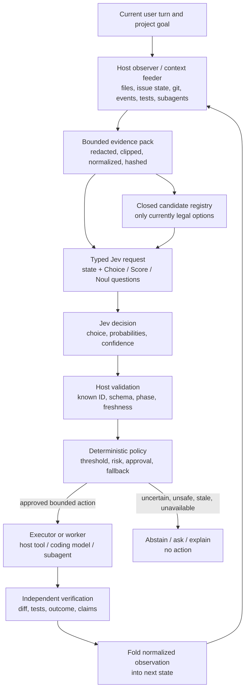
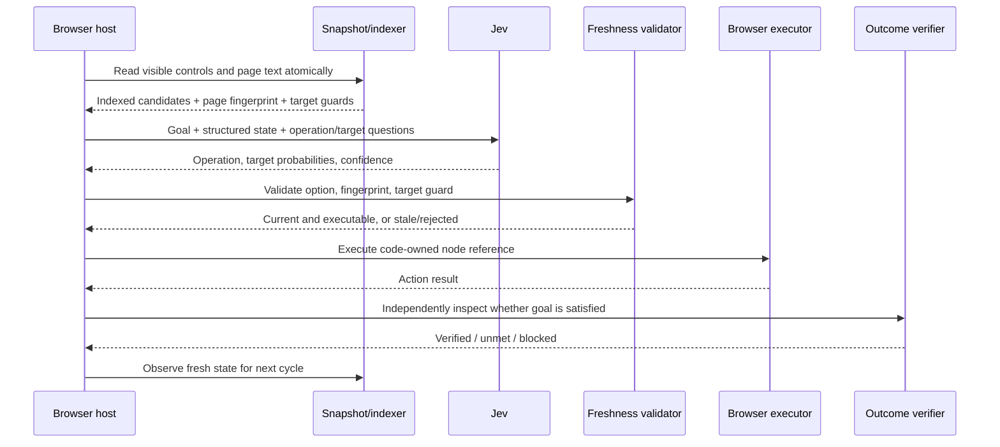
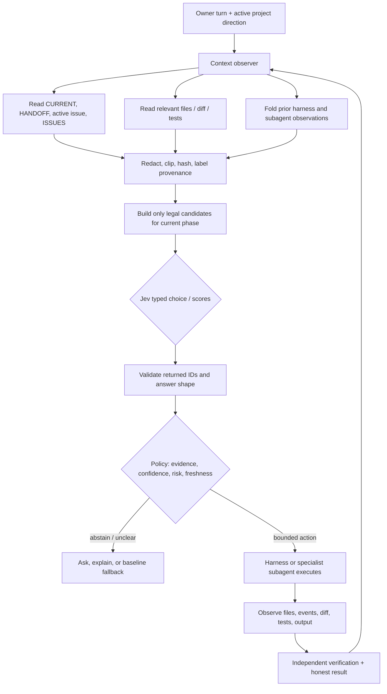

# Jev OSS architecture deep dive

**Date:** 2026-09-22  
**Scope:** public Jev integrations that use TypeSafe Jev/System One for browser control, coding-agent routing, tool safety, retrieval, workflow selection, or typed orchestration.  
**Repository status:** research only; no implementation changed by this report.  
**Source method:** inspected the public README/architecture documentation, selected source files, and license metadata on the repositories listed below. Source references are pinned to the `main` commits observed on 2026-09-22 where practical.

## Executive answer

Jev is a decision service, not a project observer and not an executor.

Every serious integration puts a host-owned observation layer in front of it:

1. the host, extension, or worker reads the current task and live state;
2. deterministic code filters and bounds that evidence;
3. deterministic code constructs a closed candidate set and typed questions;
4. Jev chooses, scores, or classifies only within that supplied schema;
5. host code validates the returned choice, applies thresholds and policy, and either abstains, asks for review, delegates, or executes;
6. the host observes the result and feeds a normalized observation into the next decision.

Jev does not discover the current issue, open `CURRENT.md`, inspect a Git diff, search a repository, call a tool, or know the project direction unless the host sends that information as `state`, question instructions, or criteria. The public implementations are unusually consistent about this boundary. The TypeSafe router says it directly: “Jev selects. Your application authorizes and executes.” [TypeSafe router](https://github.com/TypeSafeAI/typesafe-router/blob/9d62607b1da2c04019fd96712b27d692aeae1de9/README.md#L190-L204)

The most relevant result for this repository is Stanley. It does not put a general coding agent on the hot path. It registers bounded workflows, uses deterministic facts to decide which workflows are eligible, gives Jev small evidence fragments and fixed questions, and turns the answers into findings in code. A general Pi agent is only a fallback for unsupported requests, and its result is explicitly reported as unverified. [Stanley architecture](https://github.com/devagrawal09/stanley-code/blob/85f39e71db0f615b8ce6161a6672a2bf955fa7fd/docs/architecture.md#L192-L221)

The answer to “can we use some of their code for our decision tree?” is therefore:

- Yes, we should reuse the architectural patterns and, where the license permits, small isolated utilities.
- The best code-level candidates are Stanley’s workflow/eligibility/policy separation, JevWire’s provider-agnostic decision contract and response validation, pi-jev-tools’ bounded local retrieval, and Jev Ultrafast’s freshness-and-independent-verification pattern.
- We should not copy a generic orchestration framework or make Jev the owner of the state machine. The tree remains ours; Jev supplies bounded judgments inside it.
- Before any literal code copy, pin a commit, preserve the license notice, inspect transitive dependencies, and run the code through this repository’s privacy and harness-agnostic rules. MIT is confirmed for Stanley, Jev Ultrafast, JevWire, pi-jev, and pi-jev-tools. A license was not confirmed in the inspected root metadata for pi-typesafe or TypeSafe Router, so those are pattern-only references for now.

## The common architecture



The important distinction is between the boxes:

- “Jev decision” is probabilistic semantic judgment.
- “Host validation” is a protocol check: did Jev return a requested option with a valid shape?
- “Deterministic policy” is the application’s decision logic: is this option legal, sufficiently certain, safe, and authorized right now?
- “Executor or worker” is where filesystem, shell, browser, coding-model, or subagent authority lives.
- “Independent verification” is not optional merely because Jev selected `DONE` or confidence was high.

## Source register

The repositories below were selected because they expose an inspectable Jev boundary and a concrete integration rather than merely mentioning Jev. This is a high-signal ecosystem sample, not a claim that GitHub star count is a quality measure.

| Repository | Jev use | Main source examined | Commit observed | License status |
|---|---|---|---|---|
| [browser-use/jev-ultrafast](https://github.com/browser-use/jev-ultrafast/tree/1231850a0bf1a0c0341fe408ef1668dbbfdfac46) | browser operation + target selection | `agent.py`, `snapshot.js`, `browser.py`, `questions.py`, `model.py` | `1231850a` | MIT confirmed in [`LICENSE`](https://github.com/browser-use/jev-ultrafast/blob/1231850a0bf1a0c0341fe408ef1668dbbfdfac46/LICENSE) |
| [devagrawal09/stanley-code](https://github.com/devagrawal09/stanley-code/tree/85f39e71db0f615b8ce6161a6672a2bf955fa7fd) | coding workflow routing and bounded diff judgments | `docs/architecture.md`, README | `85f39e71` | MIT confirmed in [`LICENSE`](https://github.com/devagrawal09/stanley-code/blob/85f39e71db0f615b8ce6161a6672a2bf955fa7fd/LICENSE) |
| [Brainwires/jevwire](https://github.com/Brainwires/jevwire/tree/757468d6743f55225b9635e1d5f24524da79c2bc) | reusable Jev client, gate/rank/verify/next-step helpers, Claude hooks and MCP | `src/decision/types.ts`, `src/jev/client.ts`, README | `757468d6` | MIT confirmed in [`LICENSE`](https://github.com/Brainwires/jevwire/blob/757468d6743f55225b9635e1d5f24524da79c2bc/LICENSE) |
| [TheoOliveira/pi-jev](https://github.com/TheoOliveira/pi-jev/tree/549c2bfa249269d0f5590658b5743801c47af369) | Pi tool/skill routing, typed judgments, gates, compaction, optional subagent orchestration | README and `src/skills.ts` | `549c2bfa` | MIT confirmed in [`LICENSE`](https://github.com/TheoOliveira/pi-jev/blob/549c2bfa249269d0f5590658b5743801c47af369/LICENSE) |
| [Jabbslad/pi-jev-tools](https://github.com/Jabbslad/pi-jev-tools/tree/8eb7da18919fdf5522139aefefe6a208e18f8bee) | local retrieval, ranking, classification and generic typed evaluation | README and `index.ts` | `8eb7da18` | MIT confirmed in [`LICENSE`](https://github.com/Jabbslad/pi-jev-tools/blob/8eb7da18919fdf5522139aefefe6a208e18f8bee/LICENSE) |
| [twilwa/pi-typesafe](https://github.com/twilwa/pi-typesafe/tree/3942156e3d864d4d8448132e15982a50a1a57aeb) | Pi sidecar before/after tool checks and startup selection | README, `extension.ts`, `verdict.ts` | `3942156e` | No license file was visible in the inspected root metadata; pattern-only until verified |
| [TypeSafeAI/typesafe-router](https://github.com/TypeSafeAI/typesafe-router/tree/9d62607b1da2c04019fd96712b27d692aeae1de9) | generic fixed-option model/tool routing | README and project map | `9d62607b` | License not confirmed in the inspected metadata; pattern-only |
| [TypeSafeAI/typesafe-playground](https://github.com/TypeSafeAI/typesafe-playground/tree/84e99e00265e0467c90dd7ba462e4bf84edad73a) | mock graph routing and browser-agent demonstrations | `docs/tool-router.md`, `docs/jev-browser-agent.md` | `84e99e00` | Reference/demo code; no copy recommendation made |

## 1. JevWire: the cleanest protocol boundary

JevWire’s source is valuable because it makes the hidden assumption explicit in types. Its `DecisionModel` accepts a JSON-serializable `state` and a map of typed questions. A choice question contains an explicit option-to-rubric map; a score contains ordered levels; a Noul is a yes/no probability. The model returns a choice, probabilities, and confidence, but never free-form action text. [DecisionModel contract](https://github.com/Brainwires/jevwire/blob/757468d6743f55225b9635e1d5f24524da79c2bc/src/decision/types.ts#L0-L55)

The implementation separates four concerns:

```text
src/decision/  provider-agnostic types, validation, policy helpers
src/jev/       HTTP transport, timeout, retry, budget and protocol checks
src/files/     MCP-only file access
src/tools/     one-file pure tool implementations
src/hooks/     host-specific plugin wiring
```

That separation is not cosmetic. `JevDecisionModel.evaluate()` validates the questions and budgets before sending them, then validates that the response contains every requested answer with the expected answer type. The client owns retry/backoff and deadline behavior; the host still owns what to do with a valid answer. [JevWire client](https://github.com/Brainwires/jevwire/blob/757468d6743f55225b9635e1d5f24524da79c2bc/src/jev/client.ts#L0-L8) [JevWire evaluation path](https://github.com/Brainwires/jevwire/blob/757468d6743f55225b9635e1d5f24524da79c2bc/src/jev/client.ts#L99-L145)

The hook integration also shows a useful negative lesson. A deterministic prefilter skips ordinary reads, tests, `git status`, and ordinary in-project edits, so most events do not incur a Jev call. A post-tool note is advisory because it arrives after the tool ran; only a pre-execution tripwire can stop an action. The project explicitly says the classifier may not see the workspace and is not a security boundary. [JevWire prefilter and advisory boundary](https://github.com/Brainwires/jevwire/blob/757468d6743f55225b9635e1d5f24524da79c2bc/README.md#L252-L281) [JevWire limitations](https://github.com/Brainwires/jevwire/blob/757468d6743f55225b9635e1d5f24524da79c2bc/README.md#L563-L581)

### What we should take

- a provider-neutral `DecisionModel` seam so Jev is replaceable in tests;
- a single pure validation boundary for every Jev response;
- explicit request budgets, timeouts, retry policy, and model pinning;
- separate `proposed`, `validated`, `policy-approved`, and `executed` statuses;
- a clear distinction between advisory feedback and a pre-execution guard.

### What we should not take

- the Claude hook/MCP wiring;
- the assumption that a post-action warning can prevent the action;
- confidence as authorization or as a security boundary;
- a broad “judge every tool call” hot path without a measured prefilter benefit.

## 2. Jev Ultrafast: the strongest live-observer pattern

Jev Ultrafast is a browser agent, but its boundary is directly relevant to project state. The browser host first observes the world. `snapshot.js` reads visible controls, accessible names, current values, selection state, and visible text, assigns code-owned numeric node identities, and creates freshness guards. The page snapshot contains the candidate action space; Jev does not invent selectors or coordinates. [Atomic browser snapshot](https://github.com/browser-use/jev-ultrafast/blob/1231850a0bf1a0c0341fe408ef1668dbbfdfac46/jev_ultrafast/snapshot.js#L0-L105)

One decision cycle looks like this:



The Python loop records the decision against the page fingerprint, refuses to act if the page changed, rechecks target freshness immediately before input, and resolves current geometry and occlusion in code. Model output never becomes a selector, coordinate, shell command, or executable JavaScript. [Agent loop](https://github.com/browser-use/jev-ultrafast/blob/1231850a0bf1a0c0341fe408ef1668dbbfdfac46/jev_ultrafast/agent.py#L43-L113) [Execution and freshness checks](https://github.com/browser-use/jev-ultrafast/blob/1231850a0bf1a0c0341fe408ef1668dbbfdfac46/jev_ultrafast/browser.py#L82-L153)

It also separates text generation from control. Jev chooses the operation and element; a small text model is called only for `TYPE_TEXT`. The model instruction says `DONE` requires visible evidence that all requirements are satisfied, and the host independently verifies the result. [Policy questions](https://github.com/browser-use/jev-ultrafast/blob/1231850a0bf1a0c0341fe408ef1668dbbfdfac46/jev_ultrafast/questions.py#L242-L280) [README architecture and evidence limits](https://github.com/browser-use/jev-ultrafast/blob/1231850a0bf1a0c0341fe408ef1668dbbfdfac46/README.md#L196-L230) [Independent DONE verification](https://github.com/browser-use/jev-ultrafast/blob/1231850a0bf1a0c0341fe408ef1668dbbfdfac46/README.md#L262-L288)

The reported performance result is bounded: six alternating identical runs of one Google Flights task, 3/3 passes for each version, median 9.450s to 7.092s, and 1,092 to 101 median browser protocol calls. The repository explicitly says this is not a general reliability benchmark. That honesty is itself a useful evaluation pattern.

### What we should take

- deterministic observation before every decision;
- stable candidate IDs owned by the host, not generated by Jev;
- a state fingerprint/digest and target-level freshness check;
- no action until the selected candidate is revalidated against current state;
- independent verification of `DONE` and explicit blocked reasons;
- record the action before the next observation so a failed observation does not erase history.

### Translation to our repository

For a coding harness, a candidate could carry a path/bead/action ID plus an evidence digest. If `CURRENT.md`, the active issue, or the workspace changes between observation and execution, the decision should be treated as stale and the harness should observe again. We should not copy the browser DOM code; we should copy the invariant that Jev receives host-owned candidates whose identity and freshness are checked by code.

## 3. Stanley: the closest coding-agent architecture

Stanley is the most relevant example because it uses Jev around code changes rather than using Jev as a general coding model. Its README says the hot path consists of deterministic workflows that gather bounded evidence and ask Jev small fixed-choice questions; “code, not a model, makes the decisions.” Unsupported requests may fall back to Pi, but Stanley reports that fallback as unverified and uses a separate reviewed improvement path to create future workflows. [Stanley README](https://github.com/devagrawal09/stanley-code/blob/85f39e71db0f615b8ce6161a6672a2bf955fa7fd/README.md#L172-L182)

### Architecture layers

Stanley enforces a one-way dependency structure:

```text
cli -> adapters -> workflows -> core
```

- `core` knows only how to send structured questions safely, validate answers, enforce budgets, retry, and enforce the workflow contract.
- `workflows` gathers evidence, runs exact checks, asks bounded questions, and turns answers into reports.
- `adapters` implement Git, file reads, parsing, redaction, the Jev client, Pi, and the improvement queue.
- `cli` wires the pieces together, routes, delegates, prints output, and selects exit codes.

The architecture test rejects imports in the wrong direction. This is a compact way to prevent a workflow from quietly acquiring arbitrary shell, filesystem, provider, or agent authority. [Stanley folder contract](https://github.com/devagrawal09/stanley-code/blob/85f39e71db0f615b8ce6161a6672a2bf955fa7fd/docs/architecture.md#L192-L207)

### Routing is registry-based, not free-form action generation

At routing time Stanley sends Jev a redacted user request plus deterministic facts such as whether a diff exists, the input shape, each registered workflow’s JSON routing metadata, and each workflow’s deterministic `available` verdict. Jev selects one registered candidate or `cannot_tell`. Confidence thresholds and capability gates are applied by code; uncertainty falls back to an explanation or the explicitly permitted coding-agent fallback. [Stanley routing](https://github.com/devagrawal09/stanley-code/blob/85f39e71db0f615b8ce6161a6672a2bf955fa7fd/docs/architecture.md#L208-L227)

This is an important answer to the “granulated choices” question. Stanley does not ask Jev to invent arbitrary next actions from a blank prompt. The application owns a registry of named workflows such as `find`, `check`, `review`, `test_gaps`, `security_review`, and `triage_failures`. Each workflow can expose a deterministic eligibility gate. Jev chooses among those available workflow IDs, not among shell commands or arbitrary implementation plans. [Stanley workflow registry](https://github.com/devagrawal09/stanley-code/blob/85f39e71db0f615b8ce6161a6672a2bf955fa7fd/docs/architecture.md#L251-L258) [Stanley built-ins](https://github.com/devagrawal09/stanley-code/blob/85f39e71db0f615b8ce6161a6672a2bf955fa7fd/docs/architecture.md#L277-L297)

### Evidence collection and Jev questions

For a `check` run, Stanley reads the diff once, splits it into changed hunks, skips secret-shaped paths/binaries/vendor files, and runs exact checks in code first. Examples include skipped tests, removed assertions, deleted tests, whitespace-only edits, lockfiles, CI, and generated changes. Only the remaining evidence reaches Jev. Jev answers fixed yes/no, choice, or score questions about one bounded piece; code applies versioned thresholds and parks unclear results for human review. [Stanley evidence path](https://github.com/devagrawal09/stanley-code/blob/85f39e71db0f615b8ce6161a6672a2bf955fa7fd/docs/architecture.md#L214-L220)

The agent is deliberately not composable as an invisible sub-workflow. Stanley’s fallback is hard-bounded, marked unverified, cannot recursively delegate, and cannot silently activate an agent-authored workflow. The improvement worker writes one candidate into a quarantine area, validates it, and requires explicit promotion before it becomes trusted repository code. [Stanley fallback and quarantine](https://github.com/devagrawal09/stanley-code/blob/85f39e71db0f615b8ce6161a6672a2bf955fa7fd/docs/architecture.md#L222-L250)

### What we should take

- a small registry of bounded workflows with deterministic `available` predicates;
- a separate evidence collector and a separate decision/policy layer;
- code-first exact checks before spending a Jev call;
- `cannot_tell`, `notChecked`, `unsupported`, and `unverified` as first-class honest outcomes;
- trusted workflow registration and explicit promotion if an agent writes new workflow code;
- a provider-neutral core that is testable without the network.

### What we should not take

- Stanley’s complete CLI or Pi fallback;
- a self-improving workflow generator before our current control hypothesis is measured;
- a ten-workflow registry if our evidence does not show that the current four-step controller is the bottleneck;
- treating Stanley’s 112 GitHub stars or its own reports as proof of coding-agent improvement. Its architecture is evidence of a pattern, not validation for our product.

## 4. pi-typesafe: sidecar, manifest bounds, and exact limitations

pi-typesafe is a Pi extension that runs four pre-flight hazard checks before `bash`, `write`, and `edit`, then four post-write/edit quality checks. It has three modes:

- `shadow`: record assessments without changing model-visible behavior;
- `advisory`: allow the action and append qualifying feedback;
- `blocking`: refuse qualifying hazards, but allow the agent to revise and try again.

Missing credentials, provider errors, timeouts, malformed responses, or unavailable context leave the tool untouched. That is a useful operational shape for an A/B trial because the sidecar can be measured in shadow or advisory mode before it is allowed to change execution. [pi-typesafe modes](https://github.com/twilwa/pi-typesafe/blob/3942156e3d864d4d8448132e15982a50a1a57aeb/README.md#L173-L176) [mode behavior](https://github.com/twilwa/pi-typesafe/blob/3942156e3d864d4d8448132e15982a50a1a57aeb/README.md#L235-L251) [failure behavior](https://github.com/twilwa/pi-typesafe/blob/3942156e3d864d4d8448132e15982a50a1a57aeb/README.md#L283-L292)

Its startup selector is also strictly closed-world: candidates come from a manifest, the provider cannot invent a model, extension, hook, MCP server, retrieval mode, or sandbox outside the manifest, and static skills remain a floor. Invalid or low-confidence selections revert to the static manifest choice and record an abstention receipt. [pi-typesafe startup selector](https://github.com/twilwa/pi-typesafe/blob/3942156e3d864d4d8448132e15982a50a1a57aeb/README.md#L191-L223)

The context boundary is explicit. It sends selected tool input, the latest user task text, working directory/Git root, and bounded target-file context. For writes it compares snapshots; for edits it includes the edit diff. It does not scan the whole repository or read environment variables for task context. It says plainly that the task context is the latest user message, not a reconstruction of all prior authorizations. [pi-typesafe data scope](https://github.com/twilwa/pi-typesafe/blob/3942156e3d864d4d8448132e15982a50a1a57aeb/README.md#L293-L301)

The response validator is stronger than a type annotation alone: it validates the complete batch, answer IDs, answer kinds, finite ranges, declared labels, complete distributions, and score consistency. A malformed answer makes the batch abstain. The extension persists a state hash and provenance metadata, not the raw state. [pi-typesafe validator source](https://github.com/twilwa/pi-typesafe/blob/3942156e3d864d4d8448132e15982a50a1a57aeb/src/verdict.ts#L0-L95) [pi-typesafe provenance and limits](https://github.com/twilwa/pi-typesafe/blob/3942156e3d864d4d8448132e15982a50a1a57aeb/README.md#L283-L301)

### What we should take

- shadow/advisory/blocking as distinct experimental modes;
- fail-open or abstain on transport/context/schema failures, with a reason code;
- whole-batch response validation before applying any answer;
- strict byte/time budgets and snapshot matching;
- hash/provenance receipts without raw private state.

### License caution

The inspected repository root did not expose a license file in its file list. Treat pi-typesafe as a design reference, not copyable source, until a license is confirmed by a direct repository check.

## 5. pi-jev: where subagents actually appear

pi-jev is broader than the other examples. It offers semantic tool discovery, skill discovery, typed Jev evaluations, optional per-prompt automatic routing, optional tool-call guards, Jev-guided compaction, a post-run `jev-gate`, and optional `pi-subagents` orchestration. It explicitly keeps automatic mode off by default and leaves a turn untouched when Jev fails. [pi-jev feature boundary](https://github.com/TheoOliveira/pi-jev/blob/549c2bfa249269d0f5590658b5743801c47af369/README.md#L190-L205)

The typed-subagent example is the part most relevant to our question:

```text
typed Jev choice over the supplied issue body
    -> code maps bug / feature / docs to a worker task
    -> worker subagent performs the open-ended work
```

The state is explicitly passed as `args.issueBody`; Jev does not inspect the repository. Their higher-level orchestration then uses specialized workflows such as `scout -> worker -> reviewer` for implementation and parallel `scout + researcher -> worker` for research. Jev selects or constructs the workflow shape, but the subagents gather context and execute. [pi-jev typed state and orchestration](https://github.com/TheoOliveira/pi-jev/blob/549c2bfa249269d0f5590658b5743801c47af369/README.md#L269-L301)

This is the clearest public example supporting the user’s intuition that a subagent may be needed for live context. It is not required because Jev needs a subagent; it is required only when the host has chosen to use an open-ended worker for scouting or execution. A deterministic host feeder can play the same observer role for bounded facts. The key is that the observer/worker result must be returned to the host and explicitly placed into the next Jev state.

pi-jev also has a post-run gate that reads a Git diff, file, or stdin against criteria and returns an exit status. That is a verification step, not a permission to execute. [pi-jev gate](https://github.com/TheoOliveira/pi-jev/blob/549c2bfa249269d0f5590658b5743801c47af369/README.md#L243-L268)

### What we should take

- an explicit `state` argument at every Jev call;
- a clear seam between typed routing and worker execution;
- opt-in orchestration, not hidden per-turn delegation;
- post-run verification as a separate step;
- leave the host behavior unchanged on Jev failure.

### What we should not take

- automatic per-prompt Jev calls before we know they help;
- the full Pi plugin surface;
- a generic subagent graph as the first response to our current benchmark result.

## 6. pi-jev-tools: local retrieval before semantic ranking

pi-jev-tools is a small but important example because it answers “who reads the files?” in code. `jev_search` uses local `rg`-style retrieval to build a bounded pool of snippets with paths and line ranges. It then sends that pool to Jev for ranking. Jev does not scan the repository, execute a search, or recover context the host did not supply. [pi-jev-tools overview](https://github.com/Jabbslad/pi-jev-tools/blob/8eb7da18919fdf5522139aefefe6a208e18f8bee/README.md#L169-L196) [local search and bounds](https://github.com/Jabbslad/pi-jev-tools/blob/8eb7da18919fdf5522139aefefe6a208e18f8bee/README.md#L220-L257)

Its generic `typesafe_evaluate` tool states the boundary unambiguously: only the supplied state and questions are sent; it does not read files or attach the conversation automatically. Questions share the same state but are independent; dependent decisions require sequential calls or code-side selection. It never executes actions based on the answer. [pi-jev-tools state contract](https://github.com/Jabbslad/pi-jev-tools/blob/8eb7da18919fdf5522139aefefe6a208e18f8bee/README.md#L258-L302)

The tool also adds an explicit `__unclear__` classification option, keeps low-confidence candidates visible for review, limits candidate/question sizes, and reports truncation and cutoff ties. This is a good pattern for retrieval because “not found” is not silently converted into “does not exist.”

### What we should take

- deterministic local retrieval or file selection before Jev ranking;
- path/line provenance on every candidate evidence item;
- explicit `unclear` / `not_found` outcomes;
- caps and truncation metadata in the observable record;
- no action execution in the decision utility.

### License

MIT is visible in the repository metadata. Any code reuse still needs to preserve the notice and be isolated from Pi-specific APIs.

## 7. TypeSafe Router and the official playground patterns

TypeSafe Router provides the smallest generic routing equation:

```text
request + allowed options
    -> Jev choice
    -> validation + fallback
    -> effective option
    -> application authorization and executor
```

Its public API uses stable `RouteOption` IDs, labels, descriptions, and optional application metadata. The library validates that the returned choice is in the supplied list, applies a deterministic fallback or clarification policy, and explicitly does not execute the selected model or tool. It also exposes `buildRouterContext` and `buildJevRequest`, making the exact submitted context inspectable and testable. [TypeSafe Router flow and non-execution](https://github.com/TypeSafeAI/typesafe-router/blob/9d62607b1da2c04019fd96712b27d692aeae1de9/README.md#L190-L204) [TypeSafe Router fallback API](https://github.com/TypeSafeAI/typesafe-router/blob/9d62607b1da2c04019fd96712b27d692aeae1de9/README.md#L253-L303)

The playground’s tool-router demo is not a production agent, but its guard sequence is instructive. Hard rules remove secret-related candidates before Jev. Jev receives the current node and complete permitted outgoing candidates. The host requires both confidence and selected-node probability to clear the threshold, then rechecks graph membership and policy. A mutating node routes to a separate approval checkpoint. Provider failure, invented nodes, missing scores, and ambiguity stop for clarification. [Tool router guard sequence](https://github.com/TypeSafeAI/typesafe-playground/blob/84e99e00265e0467c90dd7ba462e4bf84edad73a/docs/tool-router.md#L192-L207)

The playground’s browser-agent document is a parallel implementation of Jev Ultrafast’s pattern: perceive, build the action space, make one request, validate freshness, execute, settle, independently verify `DONE`, and re-observe. [Browser-agent loop](https://github.com/TypeSafeAI/typesafe-playground/blob/84e99e00265e0467c90dd7ba462e4bf84edad73a/docs/jev-browser-agent.md#L218-L234)

### What we should take

- stable IDs and an explicit closed option list;
- a recorded distinction between Jev’s proposal and the effective fallback;
- policy-overrides and approval checkpoints represented in the result;
- a host-owned candidate graph rather than a model-owned free-form action space.

### License caution

These are useful architecture references, but a copy decision requires a direct license review for the exact files. No copy is proposed from these repositories at this time.

## What these projects actually give Jev

The following table is the practical answer to “what context did they feed it?”

| Integration | State sent to Jev | Candidate choices | Who reads live state? | Who executes? |
|---|---|---|---|---|
| Jev Ultrafast | user goal, visible page text, indexed controls, current values, last ten actions | operation heads and compatible observed element/option IDs | browser host + `snapshot.js` | browser host |
| Stanley | redacted request, deterministic diff/input facts, workflow metadata, one bounded hunk/evidence fragment | registered workflows or `cannot_tell`; fixed per-hunk labels | adapters/workflows | deterministic workflow; Pi only unsupported fallback |
| JevWire hooks | literal tool call, user request/context selected by hook, sometimes tool result | gate/rank/verify/next-step rubrics | hook host/MCP tools; not Jev | Claude/tool permission system or host |
| pi-typesafe | tool input, latest user task, Git root, target file, before/after snapshot, edit diff | fixed hazard/quality questions; manifest options at startup | Pi extension | Pi tool path; Jev can block only in opt-in mode |
| pi-jev | explicit issue body, tool/skill catalog, diff/file/stdin for gate | tools, skills, typed labels, workflow templates | Pi/plugin and optional scouts | Pi, worker subagents, or gate command |
| pi-jev-tools | local `rg` snippets, supplied items/candidates, explicit JSON state | ranked snippets, fixed categories, supplied questions | Pi tool itself | main coding model; tool does not execute decisions |
| TypeSafe Router/playground | user input, optional context, current node, permitted graph edges | fixed route options or graph nodes | host/demo code | mocked or application-owned executor |

Every row has the same shape: live state is collected outside Jev, and the candidate set is defined outside Jev.

## What our current experiment actually did

Our current implementation is not context-free anymore, but it is narrower than the OSS systems above.

### The feeder did provide

Before each matched A/B turn, `RepositoryContextFeeder` collected bounded facts from the isolated workspace:

- workspace file count and a capped file list;
- selected instruction-file names and up to three non-empty, redacted excerpt lines from selected relevant files;
- current Git branch, Git status cleanliness, changed-path names, and whether a diff was available;
- explicit file paths mentioned in the current user turn when those paths existed;
- current user turn and accumulated bounded conversation;
- turn index, turn budget, phase, constraints, retry count, timeout budget, user-input status, and current bead;
- normalized adapter observations and evidence summaries after each execution;
- a context-pack digest;
- a phase-specific list of allowed actions.

The long-run prompt then gave the harness the serialized `DecisionContext` and told it to inspect before writes and verify material changes. The same context feeder was used for baseline and Jev arms so the A/B intervention was Jev’s added decision prompt, not an intentionally different repository observer.

### The feeder did not provide

- automatic reading of `checkpoints/CURRENT.md`;
- automatic reading of `HANDOFF.md`;
- automatic reading of `ISSUES.md` or the active GitHub issue body;
- a full Git diff or full file contents;
- a context-producing scout/subagent;
- filesystem, shell, tool, or subagent authority to Jev;
- a discovered task plan derived from the current project direction.

The exact source confirms this. `_INSTRUCTION_NAMES` includes `AGENTS.md`, `PLAN.md`, `README.md`, `pyproject.toml`, `package.json`, and `CONTRIBUTING.md`, but not `CURRENT.md`, `HANDOFF.md`, `ISSUES.md`, or the active issue. Candidate beads are synthesized by `_candidate_beads()` as exactly four generic placeholders: `inspect-context`, `plan-change`, `execute-change`, and `verify-result`. See [`feeder.py`](../src/hos/controller/feeder.py), especially `_INSTRUCTION_NAMES`, `_candidate_beads()`, `collect()`, and `update()`.

The v2 Jev request still asked nine typed questions: task class, next bead, next action, delegation target, verification level, evidence sufficiency, continuation, readiness, and risk. But “next bead” was selected from the four synthetic feeder beads, not from a project-specific issue decomposition. That is why the previous result tested controller mechanics and bounded context use, not whether Jev understood the full project direction.

### What the benchmark returned

The clean 60-turn matched slice made 60 Jev decisions per harness. The minimum accepted confidence was `0.55`, but Jev’s mean confidence was only `0.419` for OpenCode, `0.409` for Grok Build, and `0.390` for Pi. As a result, Jev executed only 13, 13, and 12 of 60 turns; the remaining turns fell back before harness execution. OpenCode’s Work-match fell from 8/16 baseline to 4/16 Jev; Grok Build and Pi were 0/16 in both arms.

This means the current result is a negative promotion result for the current policy, not proof that Jev can never help. The architecture comparison explains why: we gave Jev a bounded fact pack and synthetic choices, but did not yet give it the project-direction pack that the user has been asking about, and the confidence gate made most Jev decisions non-executing. The exact benchmark is in [`reports/jev-long-ab-20260922.md`](../reports/jev-long-ab-20260922.md).

## Recommended design for our decision tree

The OSS evidence supports a narrow, host-owned tree rather than a general orchestration engine.



A future host-owned candidate registry could contain phase-legal workflows such as:

```text
INSPECT_PROJECT_DIRECTION
LOCATE_RELEVANT_EVIDENCE
PLAN_ONE_BOUNDED_STEP
EXECUTE_ONE_BOUNDED_STEP
VERIFY_RESULT
ASK_OWNER
ESCALATE_OR_ABSTAIN
```

Those are examples of a registry shape, not an authorization to add a new implementation slice now. The current active next action remains the already-authorized follow-up: make low-confidence Jev advisory, execute the baseline-equivalent feeder prompt, and rerun the matched slice. That isolates confidence-gate under-execution before adding more state or more choices.

If a later context experiment is authorized, the smallest high-value addition is a project-direction pack with explicit provenance:

```json
{
  "owner_turn": "...",
  "active_issue": {"id": "...", "title": "...", "acceptance": ["..."]},
  "checkpoint": {"active_hypothesis": "...", "last_verified_result": "...", "next_action": "..."},
  "handoff": {"current_direction": "...", "continuity_rules": ["..."]},
  "repo_state": {"branch": "...", "status": "...", "changed_paths": ["..."]},
  "evidence": [{"id": "...", "source": "path:line-or-derived-fact", "text": "..."}],
  "candidates": [{"id": "...", "description": "...", "available": true, "requires": []}]
}
```

The point is not to send every document in full. It is to make project direction an explicit, bounded, inspectable input and to make each candidate traceable to the evidence that made it available.

## Reuse decision

| Source pattern | Reuse decision | Why |
|---|---|---|
| Stanley workflow registry + `available(facts)` + `cannot_tell` | **Strong candidate** | Closest match to a coding controller; keeps candidate set and eligibility in code. MIT. |
| JevWire `DecisionModel` seam and full response validation | **Strong candidate, port semantics** | Gives us a clean fakeable Jev adapter and a single validation boundary. MIT; TypeScript code would need a Python-native port. |
| pi-jev-tools local retrieval and provenance/caps | **Strong candidate, port semantics** | Directly addresses how live files become bounded evidence before Jev. MIT. |
| Jev Ultrafast candidate IDs, freshness guards, independent `DONE` verification | **Strong candidate, port semantics** | Prevents a stale Jev answer from being executed against changed state. MIT. |
| pi-jev typed state + optional scout/worker/reviewer | **Selective pattern** | Use explicit state and a subagent seam only where open-ended scouting is needed. MIT. Do not import the whole plugin. |
| pi-typesafe shadow/advisory/blocking and snapshot receipts | **Pattern only until license check** | Excellent experiment/failure behavior, but no license was confirmed in the inspected tree. |
| TypeSafe Router/playground generic graph | **Pattern only until license check** | Good fallback/approval semantics; demo routing is not evidence of production execution. |
| Generic orchestration/state-machine framework | **Do not add now** | Conflicts with the project’s prompt/context-first rule and is not earned by the current evidence. |

## Conclusions

1. The user’s core intuition was correct: Jev cannot know live project state unless another component reads it and feeds it in.
2. A subagent is one possible observer/executor, not a requirement of Jev. Deterministic code can collect bounded facts; a subagent is useful for open-ended repository scouting or implementation.
3. The public coding examples do not use Jev as a free-form “what should the whole agent do?” oracle. They use fixed workflow/tool/skill candidates and small evidence-specific questions.
4. Our current feeder is a meaningful first step, but its project-direction context is incomplete and its four candidate beads are generic placeholders. The clean A/B result therefore should not be interpreted as a definitive test of a fully context-aware decision tree.
5. The next safe experiment remains the one already recorded in `checkpoints/CURRENT.md`: keep the feeder, schemas, models, fixtures, and timeouts fixed; make low-confidence decisions advisory; run the same baseline-equivalent prompt; then measure whether Jev’s selected hint helps when it no longer suppresses execution.
6. Only after that result should we consider a separate, tightly scoped context-direction experiment. If it is authorized, borrow the evidence/registry/validation patterns above rather than building a general orchestration platform.
